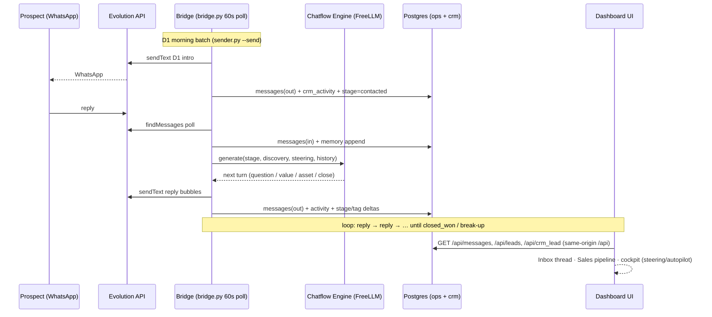
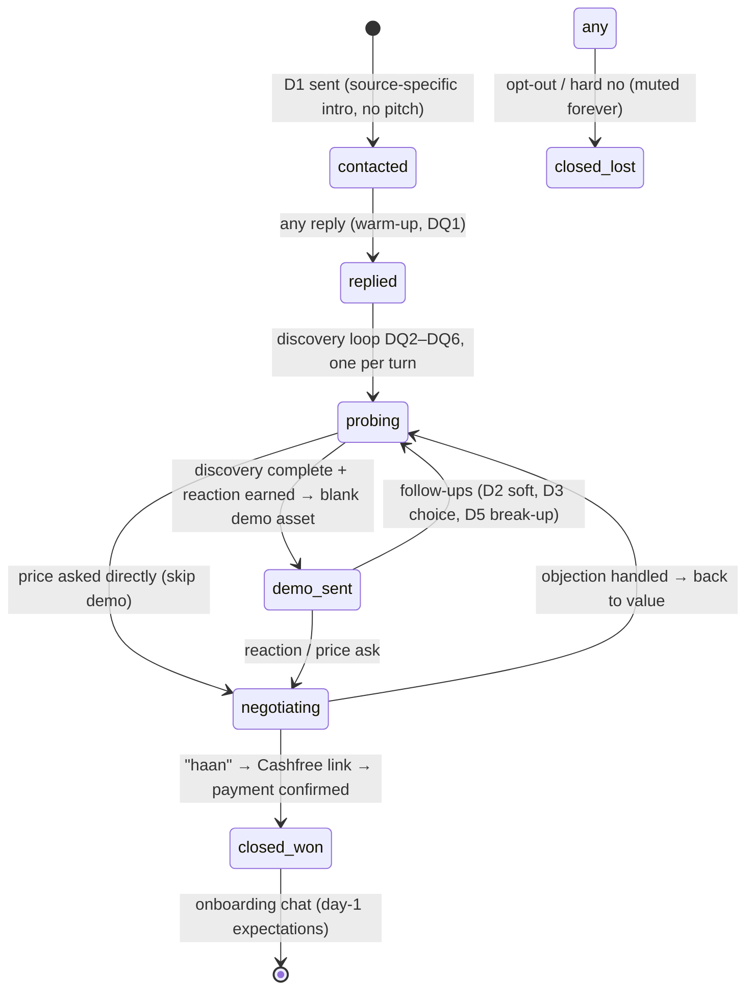
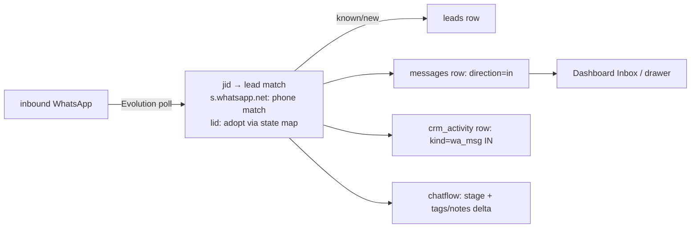
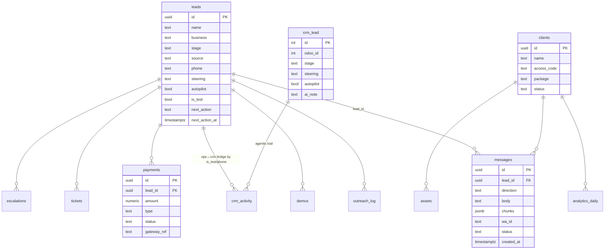

# ARCHITECTURE — LGE Pilot (v1.0, 31-Aug-2026)

> Companion to `crm/CHATFLOW.md` (the playbook) — this doc is the **structure**:
> how messages flow, how state advances, what lives where. All diagrams are mermaid
> (render natively on GitHub).

## 1) End-to-end outreach & sales sequence (the happy path)



## 2) Conversation state machine (chatflow)



## 3) Data flow states per message (write-path invariants)



## 4) Entity map (current pilot schema)



## 5) ERP view — modules of the whole agency (where LGE sits)

```mermaid
flowchart TB
    subgraph ACQ["Acquisition"]
        OUT[Outreach sender]
        BRIDGE[WhatsApp brain<br/>chatflow engine]
        ADS[Meta click-to-WhatsApp ads]
    end
    subgraph CRM2["CRM Core (this repo)"]
        LEADS[(leads + crm_lead)]
        ACT[(crm_activity / messages)]
        CHAT[Chatflow engine]
    end
    subgraph DELIV["Delivery (post-sale)"]
        ASSETS[(assets: blogs/posts/placards)]
        REV[Review gating + AI replies]
        PORTAL[Client portal]
    end
    subgraph FIN["Finance"]
        PAY[(payments: Cashfree)]
        INV[Invoices (manual, pilot)]
    end
    subgraph OPSX["Ops"]
        TCK[(tickets)]
        ESC[(escalations)]
        ANA[(analytics_daily)]
    end
    OUT --> LEADS
    ADS --> LEADS
    LEADS --> CHAT
    CHAT --> ACT
    CHAT -->|stage deltas| LEADS
    CHAT -->|won| PAY
    PAY --> DELIV
    DELIV --> ASSETS
    DELIV --> PORTAL
    DELIV --> TCK
    DELIV --> ESC
    DELIV --> ANA
    PORTAL -->|login code| CLIENTS2[clients]
```

## 6) Guardrails (hard, in bridge.py)
- test thread (`is_test`) → ingest-only, **no auto-replies ever**
- opt-out regex → `stopped` + never message again
- caps: 4/lead/day · 40/day global · 45s anti-burst
- quiet hours 21:30–08:00 IST · groups/status skipped
- single-flight flock (no concurrent passes)
- demo sends = blank assets only until design pipeline approved

## 7) Known gaps → next iterations
| Gap | Plan |
|---|---|
| Demo assets are blanks | design pipeline (ComfyUI/Canva API) later — pending owner check of chatflow first |
| Payment confirm is manual | Cashfree webhook → `payments.status=paid` → auto `closed_won` |
| Single test thread only | 5-thread dry pilot before ramp |
| Sender + bridge split | merge into one scheduling brain (v3) |
| No auth on dashboard | PIN gate before real client data |